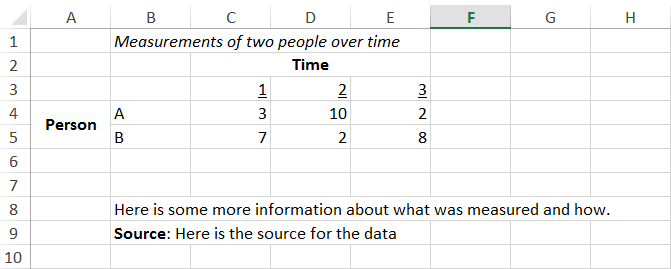

# Initial Data Tidying and exploration {#tidy_data}

## Introduction 

>'Can you do Addition?' the White Queen asked. 'What's one and one and one and one and one and one and one and one and one and one?'
>'I don't know,' said Alice. 'I lost count.'

[REF TO THROUGH THE LOOKING GLASS]


Computer's operate with linear streams of discrete values. People don't. One of the first challenges in data science is therefore understanding how computers process digital data, when they are reading the data, working with the data, and writing out the data. This chapter will provide this understanding, in order to make sure you use approaches for writing and reading data that are appropriate for the tasks. 


## Eight ways of dividing file and data types 

The purpose of this section is to introduce some key distinctions relating to types of files and types of data. 

Within this section a number of code examples are provided as illustrations of the concepts being discussed. These examples make use of packages and techniques that will be formally introduced later in this book. For now, just pay attention to the key ideas, inputs and outputs, and do not be concerned about how the code 'works'. Once you have read this book and related material, consider revisiting this section with a focus on the code itself. 

### Division One: Text files and binary files 

There are many types of files on computers, usually identified with different file extensions, such as `.zip`, `.csv`, `.exe`, `.doc`, `.pdf`, and so on. Such files can be categorised into two groups:

* Text files
* Binary files 

A text file is a file that, when opened with a basic text editor, like Notepad on Windows or TextEdit on OSX, will tend to display strings of characters that are human readable. A poem or short note written in Notepad would be an example of this, but so are other types of file that, though not written so as to be read by people (at least not for fun or enlightenment) nevertheless clearly contain text when displayed in a text editor. 

As an example of a text file written in a plain text format, we can look to Project Gutenberg [REF], an online repository of classic literature that's old enough to be copyright free. This contains plain text copies of many books, as well as an application programming interface (API) for loading the data directly called `gutenbergr`[REF]. 

For example, a plain text version of Lewis Carroll's *Through the Looking Glass* is available [here](https://www.gutenberg.org/files/12/12.txt). We can read the first few lines of this file directly into R using the `readLines()` function. 


```{r}
readLines("http://www.gutenberg.org/files/12/12-0.txt", n = 10)

```

We can also access the same data through the `gutenbergr` API, as follows:

```{r looking_glass}
require(tidyverse)
require(gutenbergr)
gutenberg_metadata %>% 
  filter(title == "Through the Looking-Glass")

looking_glass <- gutenberg_download(12)

looking_glass %>% select(text) %>% slice(1:20)

```

By contrast, binary files are all other file types. The term 'binary' refers to the fact that computers work with zeros and ones. Binary files are those that don't clearly or obviously display as text when you look at them through a basic text editor. Instead the computer needs something more specialised for reading and interpreting that particular file type in order to make sense of it. 

The `readLines` function tries to load and display the contents of any file, assuming it is a text file, even when it is not. For example, if we try to read the first five 'lines' of an .mp3 file of a song by the Norwegian electronic music duo Royksopp, we get the following:


```{r read_rproj_as_lines}
readLines("chapter_support/05/03 49 Percent.mp3", n = 5)

```

(Note: the above text still does not make any sense even if you read Norwegian!)

### Division two: Rectangular and non-rectangular data

A distinction between types of data is between *rectangular* and *non-rectangular* data. To some extent, the difference between these two types of data should be obvious: a rectangular data file contains data that the computer expects to be arranged in some kind of rectangular table. Non-rectangular data is any other type of data. 

#### Rectangular Data

An example of rectangular data, available from the data-sharing website `figshare`, is shown below. The data reports the body mass index (BMIs) of participants in a study recorded at different time points. In the example below, the first five lines of the data are first loaded with the `readLines` function we used earlier, then using a special function, `read_csv` designed to work with rectangular data through an understanding of how the stream of data inside the file is split into different columns and rows:

```{r text_rectangle_example}
readLines("https://ndownloader.figshare.com/files/10905845", n = 5)
read_csv("https://ndownloader.figshare.com/files/10905845", n_max = 5)

```

We can see in the two examples above that, though the `readLines` function has split the above data into different rows, the contents within each row are stuck together, separated by the `,` symbol. The `read_csv` function, however, has split these values into separate columns, producing the rectangle of data that we largely expect. The `read_csv` output still has some problems, which we will fix later, but it's more suitable for this type of data. 

In order to understand how R manages to convert a text file, which is really just a stream of values, into a rectangle, in which values are neatly arranged into rows and columns, it can be helpful to think of the text file as a long length of ticker tape, and functions like `read_csv()` as a robot with a rulebook and a pair of scissors. The ticker tape contains a long series of symbols, and the rulebook gives instructions about how to cut up the ticker tape, and arrange the pieces. 

To get an even clearer idea about what this ticker tape contains, the function `readChar()` can be used rather than `readLines` above. `readChar()` carries no scissors, and does not even start to cut up the input into separate pieces. The first 200 characters in the data above are as follows:

```{r}
readChar("https://ndownloader.figshare.com/files/10905845", nchars = 200)

```

Just as with `readLines()`, the individual values within each row are separated from each other using the `,` symbol. Unlike the output from `readLines()`, however, something else is visible at regular intervals within the stream. In the output above this is represented as follows: `\n`. Although this looks like two characters, it's actually just a single character, a special character type known as the 'new line' or 'line feed' character. This character is usually invisible, and meant as an instruction for a computer program (like Word or Notepad) to separate out the contents of a text file onto different lines.  

By comparing the output from `readChar()` and `readLines()`, we can see that `readLines()` cuts the input from the file into separate outputs whenever it encouters the `\n` character. Each of the pieces is then laid out to the user in the sequence it was encountered and cut. `readLines()` rulebook is simple: cut the data at the `\n` symbol.

The `read_csv()` rule-book is a bit more complicated, but follows the same principle of cutting at specific symbols. It follows something like the following system of rules:

* First: Cut the stream into discrete chunks separated by the `\n` symbol. 
* Second: *Within each of these discrete chunks*, cut the chunk again whenever the `,` symbol is encountered. 

The first of these rules thus creates each of the rows for the dataset, and the second of these rules then creates a series of cells inside each row. In order for these cells to form a rectangular dataset, there must be the same number of cells in each row, because the number of columns in the dataset must be the same for all rows. An additional rule applied by `read_csv()` and related functions is to produce either a warning or an error if the number of commas within each of the lines is not equal.

#### Non-rectangular data

It's likely that you'll be working with rectangular data most of the time. However it's useful to be aware of what non-rectangular data can look like, and to think about the cases where non-rectangular data structures are most appropriate. Much of the internet is built using structured non-rectangular data written as text files. An simple example of this is the following:

```{r json_example}
require(jsonlite)

readLines("chapter_support/05/simple_json.json")

read_json("chapter_support/05/simple_json.json")

```

Non-rectangular data structures are hierarchical and tree-like. This ordered structure can be shown more clearly using the `Hmisc::list.tree()` function, below:


```{r vis_json_tree}

json_dta <- read_json("chapter_support/05/simple_json.json")

json_dta %>% Hmisc::list.tree()

```

In the above, the data structure has a single 'root', which splits into two branches, `edibles` and `inedibles`. The `edibles` branch itself has two branches, `fruit` and `vegetables`, which have four and three sub-branches respectively. At the end of the sub-branches are the data objects themselves themselves: four fruits, and three vegetables. The `inexibles` branch is less deep, as indicated by the number of `.` marks on the left of each line, and leads directly to four objects at the same level. 

> Activity: graphically draw the above tree. 


#### Rectangular representation of the above

The same information can often be represented using either rectangular or non-rectangular data structures. For example, a rectangular representation of the above data is as follows: 

```{r rect_rep}
rect_rep <- 
  tribble(
    ~edi_class, ~fruit_or_veg, ~name,
    "edibles",   "fruit",       "apples",
    "edibles",   "fruit",       "oranges",
    "edibles",   "fruit",       "tomatoes",
    "edibles",   "fruit",       "lemons",
    "edibles",   "vegetables",  "potatoes",
    "edibles",   "vegetables",  "sweet potatoes",
    "edibles",   "vegetables",  "aubergines",
    "inedibles", NA,            "tables",
    "inedibles", NA,            "benches", 
    "inedibles", NA,            "chairs",
    "inedibles", NA,            "pots"
)

print(rect_rep, n=20)

```

Note in the above the use of quotation marks `\"` for the contents of the cells in the rectangles. This tells R that the expected content of the cell should be a character string, and that this character string will be created within the code itself, rather than fetched from somewhere else. 

Note also the use of `NA`. This means "not applicable", and tells R that the cells being referred to should be left 'empty' rather than filled with a value. In the above example, `NA` is used to indicate that it is not appropriate to try to categorise pots, benches, chairs and other inedibles as either a fruit or a vegetable. Often, `NA` is also used to indicate that data are missing, rather than that the fields (broadly synonymous with columns when working with rectangular data) are inappropriate.   

## Data and metadata 

Another useful distinction when considering the contents of a file is between 'data', i.e. the values on which various forms of quantitative analyses will be performed, and metadata, meaning additional information relating to the data. The distinction is not always hard-and-fast, as information that could be metadata in one file could be provided as data in another, but often important to bear in mind. 

### Data with informal metadata: NorthWestern Medicine BMI data


As a simple example of the data/metadata distinction, let's return to the data downloaded from `figshare` earlier. A direct link to the data itself was used earlier, but to make sense of the data, additional information is needed, which is available from [this URL](https://figshare.com/articles/Northwestern_Medicine_BMI_data/6059513). When this website is looked at through a web browser, we can see both a preview of the contents of the data which we downloaded earlier, and below that some further information:

> *Northwestern Medicine BMI data*

>Dataset posted on 21.12.2017, 12:49 by John C. Lang Hans De Sterck Daniel M. Abrams

>Northwestern Medicine (NU) data are stored in NU.csv comma separated values (CSV) format. This file contains five columns: year t, BMI in year t, BMI in year t + 1, age in year t, and gender. Note: When BMI in year t + 1 is unavailable then the entry in the third column is -1.

Many computer scientists and information specialists may baulk calling the above description 'metadata', because this additional information is not stored in a way meant for machines to easily understand. However it is 'metadata' in the sense of being additional information about the dataset itself, and information that we require in order to allow R to work with it in the most appropriate way. Our tasks are therefore to interpret and infer the above information correctly, and produce formal (machine-interpretable) metadata that R can understand and respond to appropriately. 

We can think of the contents of the paragraph at the bottom as containing the 'metadata' we need to use the data appropriately. We know from this three new things:

1. The column names are not really the names of the names of the first row. 
2. One of the columns indicates a year, two indicate BMI values, one indicates age, and one indicates gender 
3. The value `-1` has a special meaning. It means the data are missing for that participant in that year. 

With the above (informal or inferred) metadata, we can reload and re-format the data in a more appropriate way. 
### From informal 'metadata' to formal metadata

We can start by giving appropriate names to each column. This means that the values of the first row in the dataset are not used (incorrectly) as the column names. 

```{r reload_bmi_data, cache = T}
bmi_dta <-
  read_csv(file = "https://ndownloader.figshare.com/files/10905845", 
         col_names = c("year", "bmi_t0", "bmi_t1", "age_t0", "gender")
         )

```

Next we can change the `-1` values to `NA`, R's way of representing missing data. 

```{r}
bmi_dta <- 
  bmi_dta %>% 
  mutate_each(funs(ifelse(. == -1, NA, .)))

bmi_dta

```

Notice that the second column, which used to be `-1`, is now listed correctly as `NA`, i.e. missing. 

In the above example we used the term `metadata` to refer to information that we inferred by reading some text meant for people to read. Often `metadata` is used in a more formal way, to refer to data about data written for machines to understand. 

For example, the gender column currently contains `1`s and `0`s. We know that it refers to two distinct categories of participant, male and female, but R does not. R would have to be told explicitly about the categorical quality of the values in this column, as otherwise it may process the data in inappropriate ways. For instance, if we try to summarise the contents of this column, we are likely to be interested in the numbers of males and females in the dataset. However, R might expect us to be interested in the average value of all rows in the column.


```{r}
summary(bmi_dta)

```

In the above, the summary for the gender colunn gives a mean of `0.3692`, indicating that around 37% of the participants are of the gender indicated by the value `1`. However, a more appropriate way of summarising this column might be to give a tally of each category of participants. 

We can get a sense of the kind of meta-data R has attached to each column by looking back at the table output when we printed `bmi_dta` above. Immediately below the column names is a line containing either `<int>` or `<dbl>`. `<int>` means 'integer', and means that only whole numbers (`0`, `1`, `2`, `3`, etc.) are accepted in that column, and `<dbl>` means 'double', which means that non-integer numeric values, like `2.15`, are also acceptable as inputs. 

We can change the metadata associated with the `gender` column to indicate a different data type, suitable for this type of information, in the following way

```{r}
bmi_dta %>% 
  mutate(gender = factor(gender))
```

The column `gender` now has the data type indicator `<fctr>` just beneath it, suggesting it is now a factor. We can now see how the `summary()` function works differently with this data type than the earlier, integer data type.


```{r}
bmi_dta %>% 
  mutate(gender = factor(gender)) %>% 
  summary()

```

The `summary()` function now summarises the gender column in a different way, with a tabulation by group rather than mean of the values. 


#### The ghost in the machine: making an educated guess about gender labels

One point we should note in the above is that we still do not know, from the information provided, which label (0 or 1) refers to which gender. Does a `1` indicate males, or females? 

Frustratingly, this information is not clearly stated in the [associated article](http://journals.plos.org/plosone/article?id=10.1371/journal.pone.0189795) or appendices either. Because of this, we may have to look at the associated code in order to guage this basic fact with certainty, though we can probably guess which code refers to which gender using some additional domain knowledge:

* Females live longer than males, so *if the hospital sample data are representative* of the whole US population, we might expect a higher average age for females than males. We might also expect the upper end of the distribution, such as the upper quantile (the age at which 25% of the sample are older and 75% are younger) to be higher too.
* Females tend to have somewhat higher variance in BMIs than males. (e.g. https://www.ncbi.nlm.nih.gov/pubmed/23675464) 

Let's try to infer gender using this additional information, by summarising some key statistics for various columns by gender.

```{r}
bmi_dta %>% 
  group_by(gender) %>% 
  summarise(
    mean_bmi = mean(bmi_t0, na.rm = T),
    var_bmi  = var(bmi_t0, na.rm = T),
    mean_age = mean(age_t0, na.rm = T),
    uq_age   = quantile(age_t0, probs = 0.75, na.rm = T)
  )
  
```

```{r}
bmi_dta %>% 
  filter(!is.na(gender)) %>% 
  ggplot(aes(x = bmi_t0)) + 
  geom_histogram() + 
  facet_wrap(~gender)

```

Based on this, we might feel more confident assuming that a `0` in the gender column indicates females, and so a `1` indicates males. Depending on how sure we need to be about this, we might either decide to go with these coding assumptions, or to seek further information to (dis)confirm this suspicion. 

For now, let's recode the gender according to our current best assumptions: 

```{r}
bmi_dta <- 
  bmi_dta %>% 
    mutate(gender = case_when(
      gender == 0 ~ 'female', 
      gender == 1 ~ 'male'
      ) %>% factor()
    ) 

bmi_dta

summary(bmi_dta)

```

The `gender` column now contains data of class `factor` (`<fctr>`) in the above). We can see from the summary that the male number of rows per category is as before. 

Factors in R contain an additional type of metadata. Rather than repeatedly writing the word 'male' and 'female' in each row, R represents each label by a number, and contains a look-up table linking each number to each label. We can start to learn more about how R does this by typing the following:

```{r}
head(bmi_dta$gender)
head(as.numeric(bmi_dta$gender))
levels(bmi_dta$gender)

```

The first of these commands shows the first five items in the column: two males then three females. The second shows the numeric values actually stored, and the last function shows the labels associated each of these successive values (1, 2). Turning the gender column into a factor has created two additional types of metadata: a new identifier for the class of the data in the column (a `factor` rather than `integer`); and a value-label look-up table like the following:

| value  |  label | 
| -----  |  ------|
|   1    | female | 
|   2    | male   | 

If the dataset we have been working on in R were saved as a standard text file, much of this metadata would be lost, and have to be supplied elsewhere. But instead if it were saved in R's own binary file format, `.rds`, much of it would be retained. 

There are thus some important trade-offs to bear in mind when deciding what type of file to use to store data. 

| Data Type  | Advantages | Disadvantages | 
| ---------- + ---------- + ------------- |
| Text       |  
<ul>
  <li> More interoperable: Works with many programs
  <li> Likely to remain readable across time
</ul>
| 
<ul>
  <li> Metadata lost 
  <li> Sometimes produces larger file sizes
</ul>
| Binary     | 
<ul>
  <li> Data and metadata in same file
  <li> Sometimes file sizes are smaller, faster to read etc
</ul>
|
<ul>
  <li> Less interoperable
</ul>
| 

* Note to self: fix the above


## Tidy and untidy data 

A final way of distinguishing between rectangular data is between *tidy data* and *untidy data*. This distinction, like many recent developments in the use of R for data science, was popularised by Hadley Wickham, via a [2014 article](https://www.jstatsoft.org/article/view/v059i10/v59i10.pdf) and associated software. 

Wickham defines data as tidy if the following is true:

1. Each variable forms a column
2. Each observation forms a row
3. Each type of observational unit forms a table

As is often the case, tidy data is often easiest to understand through examples, rather than purely through definition. One of the first examples given in the [2014 article](https://www.jstatsoft.org/article/view/v059i10/v59i10.pdf) concerns the following table:

| row | a | b | c |
| --- | - | - | - |
| A   | 1 | 4 | 7 | 
| B   | 2 | 5 | 8 | 
| C   | 3 | 6 | 9 |

A tidy data version of the above looks as follows:

| row | column | value |
| --- | ------ | ----- |
|  A  | a      | 1     | 
|  B  | a      | 2     | 
|  C  | a      | 3     | 
|  A  | b      | 4     | 
|  B  | b      | 5     | 
|  C  | b      | 6     | 
|  A  | c      | 7     | 
|  B  | c      | 8     | 
|  C  | c      | 9     | 

My own way of thinking about tidy data is to think about the columns in a dataset as being of two fundamentally different types: 

* Where/locator variables
* What/measurement variables

For the third of the criteria above to be true, "Each type of observational unit forms a table", each row must have a unique combination of locator variables. In the table above, the columns marked `row` and `column` are the locator variables, and the column marked `value` is the measurement variables. 

For example, imagine that, instead of the 3-by-3 table above, we had a table giving height above sea level (in km) for various combinations of latitude and longitude:

| latitude | 10 | 20 | 30 |
| --- | - | - | - |
| 10   | 1 | 4 | 7 | 
| 20   | 2 | 5 | 8 | 
| 30   | 3 | 6 | 9 |

The tidy data version of this table now looks as follows:

| latitude | longitude | elevation |
| --- | ------ | ----- |
|  10  | 10      | 1     | 
|  20  | 10      | 2     | 
|  30  | 10      | 3     | 
|  10  | 20      | 4     | 
|  20  | 20      | 5     | 
|  30  | 20      | 6     | 
|  10  | 30      | 7     | 
|  20  | 30      | 8     | 
|  30  | 30      | 9     | 

It's clear in this example that elevation is *what is measured*, and latitude and longitude are needed to define *where it is measured*. Both latitude and longitude need to be specified in order for the measurements to be 'labelled' correctly. Similarly, we could imagine additional measurements, like average annual rainfall, having been taken at the same locations, which would be recorded in the table as an additional *what* column:

| latitude | longitude | elevation | rainfall | 
| --- | ------ | ----- | ----------| 
|  10  | 10      | 1     | 15 | 
|  20  | 10      | 2     | 20 | 
|  30  | 10      | 3     | 10 |
|  10  | 20      | 4     | 40 |
|  20  | 20      | 5     | 10 | 
|  30  | 20      | 6     | 5  | 
|  10  | 30      | 7     | 45 | 
|  20  | 30      | 8     | 35 |
|  30  | 30      | 9     | 20 |

Once additional columns are added, the advantages of the tidy data arrangement starts to  become clearer. If the original table structure were used, with each row a different latitude and each column a different longitude, then two separate tables would have to have been produced. With the tidy data arrangement, the *where* columns define the table's observational unit, and so long as measurements pertain to the table's observational unit, then they can be added as additional *what* columns in the dataset, as above. 

In order to think further about what's meant by an observational unit, let's return to the example of rainfall. In the above example, the `rainfall` column is the annual average rainfall. But of course not all years are alike. We could instead imagine a new table, which includes `latitude`, `longitude` and `year` as *where* variables, and `rainfall` as the only *what* variable:

| latitude | longitude | year | rainfall | 
| --- | ------ | ----- | ----------| 
|  10  | 10      | 2000     | 15 | 
|  20  | 10      | 2000     | 20 | 
|  30  | 10      | 2000     | 10 |
|  10  | 10      | 2010     | 18 | 
|  20  | 10      | 2010     | 22 | 
|  30  | 10      | 2010     | 9 |

Why would `elevation` not be included in the above table, with its latitude-longitude-year observational unit? Because, barring an earthquake, volcanic eruption, or Dutch engineering, `elevation` is likely to remain constant over each of the observed years, so recording elevation for each latitude-longitude-year combination will lead to much repetition of the data within the dataset. For elevation, the differences (in terms of years) do not make a difference to the measured values. The appropriate observational unit for `elevation` is `latitude-longitude`, not `latitude-longitude-year`. 

Much as you can crop a larger image to produce a smaller image, but not uncrop a smaller image to produce a larger image, a dataset using a `latitude-longitude-year` observational unit can be used to produce a `latitude-longitude` observational unit, but not vice-versa. Later in this chapter we will discuss how to do this using the `group_by` and `summarise` functions. 


### Section summary

In this chapter section we have introduced a number of core distinctions between types of data and types of file used to store them. This includes: 

* the text/binary file distinction; 
* the rectangular/non-rectangular data distinction; 
* the data/metadata distinction; and 
* the tidy/untidy data distinction

Although a number of examples have been provided in order to illustrate some of these distinctions, and the code used to produce these examples has been displayed, the contents of this code, including the particular functions and packages used, have not been formally introduced. The next section of this chapter will provide this more formal introduction. After you have been introduced formally, and progressed further with the rest of the book, consider returning to the examples above with a greater focus on the code rather than the principles. 


## Loading and saving data - R packages and functions

As you will have seen from the examples earlier in this and previous chapters, R makes use of a large number of functions, stored in a number of different packages. Because R is open source, the bar to adding new packages and functions is low, and because of this, and R's large user and developer base, there are many thousands of packages available. 

In the previous examples, a number of relatively 'exotic' functions and packages, like the `jsonlite` package, were used to illustrate some of the above distinctions. However, in practice we will largely be working with rectangular data stored as text files. To work with such data, we can largely stick with functions that are within the `tidyr` packages, which is part of `tidyverse`, and loaded along with other related packages whenever we load the `tidyverse` package. 

### Loading a new package

Using a function within a package usually involves the following two steps:

1. Install the package of interest from the internet to your machine
2. Load the package from your machine to the particular R session you are working on currently. 

The first of these steps only has to be done once per machine you work with. The `install.packages()` function can be used to install the required packages. For example, to install the `tidyverse` package, we would write and run the following:

```{r, eval = F}
install.packages("tidyverse")

```

After the package has been installed on your machine, it can be loaded using any of the following

```{r, eval = F}
library(tidyverse)
require(tidyverse)

pacman::p_load(tidyverse)

```

Both the `library()` and `require()` functions are part of Base R. They will be loaded on your R session whenever you load up R. The third expression calls a function within a new package, `pacman`, which is a package designed to manage other packages. (pacman: *pac*kage *man*ager.) The `library`, `require` and `p_load` functions differ in terms of what they check for before attempting to load a package:

* `library()`: Loads the package
* `require()`: Checks whether the package has already been loaded. If not, loads the package.
* `p_load()`: Checks whether the package has been installed and loaded. Installs the package if not already installed, and loads the package if not already loaded. 

The `p_load()` function may be preferable if you want to run a script multiple times, on different machines. This is because the required packages may be installed on one machine but not another. By first checking that the package has been installed, and installing if necessary, this means the scripts should work unmodified on each machine. (So long as the `pacman` package itself has been installed.) Otherwise, you will have to remember to use `install.packages()` the first time you run the script, but also remember to not run it each time, because otherwise you are wasting valuable time reinstalling the same package each time. A good way to ensure you do this is to remember to comment out the `install.packages()` line after running it within the script.

```{r, eval = F}
# install.packages("tidyverse")
```

Note: Within RStudio you can turn lines of code into comments, and vice-versa, by selecting the lines of interest and pressing `Ctrl+Shift+C`.

If you wish for a script to first check whether the `pacman` package has been installed on a machine, you can include the following line at the start of the R script 

```{r, eval = F}
if (!("pacman" %in% rownames(installed.packages()))) install.packages("pacman")

```

The line above is an example of a conditional statement. It states that: if the name `"pacman"` is *not* in a list of package names returned by the function `installed.packages()`, then install the package `pacman`. There are a number of different ways of expressing the same conditional statements, and the above is not the easiest expression to understand, but it will work as required. So long as the `pacman` package is installed, the installation of all other packages can be managed using the `pacman::p_load()` function. 

But first, let's explain what's meant by 'loading' a package. Whenever you type a name ending with `()` at the end of it, R thinks you are asking for a function to be run, with that particular name. For example, if you were to type `select()`, R would look for a function called `select`. But where does it look? 

R looks for functions inside a list of packages. This list can be found by typing `search()` in R. 


```{r}
search()

```

When R is looking for a function with a particular name, it starts at the top of the list of packages and works its way down. As soon as it finds a function with the name you've specified, it stops looking.

This behaviour is R's way of resolving ambiguity when two packages contain a function with the same name. What this can mean, however, is that that the same code could work differently depending on which packages have already been loaded, and the order in which they were loaded. 

For example, both the `dplyr` and the `stats` package contain functions called `filter`, but these are different functions with different behaviours. Looking through the search list, we see that the `dplyr` package is enountered earlier in the list than the `stats` package, and so `dplyr`s `filter` function will, for our current R session, be used instead of `stats`' `filter` function. But what if: 

1. We want to ensure that the code always refers to the `dplyr` `filter` function, regardless of the order in which packages have been loaded in a session? 
2. We want to use the `stats` `filter` function, while also having loaded the `dyplr` package? 
3. We want to use a particular function within a package, without having to load the package itself?

Each of these challenges can be solved by being more explicit about which package we want to use a function from, which we can do using the `::` operator, known as the scope operator. For example, if we wanted to see the first few rows of the `bmi_dta` data_frame we created earlier, with gender now explicitly labelled rather than simply coded with 0 and 1, we could filter to only include females as follows:

```{r}
bmi_dta %>% 
  filter(gender == "female")

```

However, this only works because of the particular package search space we have created by loading the packages in the order we did in our session. If someone loads the packages in a different order and runs the same code, they may not get the same outcome. We can make the above line of code more explicit by using the scope operator as follows:


```{r}
bmi_dta %>% 
  dplyr::filter(gender == "female")

```

In this case, you can see there is no difference in terms of what's been produced. However, making the functions required explicit in this way can help uncover and resolve issues about package dependencies, especially when code are shared by users.

The syntax for the `::`operator is as follows:

`[PACKAGE NAME]::[FUNCTION NAME]`

i.e. just write the package name, then the `::`, then the function name. 

## Functions and packages for working with data of different types 

### Rectangular text data

We have been encountered some examples of functions for working with data of different types earlier, but we have not yet been formally introduced. This book emphasises the use of the tidyverse suite of packages and functions, because they are designed to work together elegantly. However, most functions for loading and saving data which the tidyverse uses are modelled very closely on earlier packages included with base R, with only slight changes in functionality. We will thus look at some examples of both the tidyverse and base R solutions. 

The majority of your work is likely to involve working with rectangular data saved as text files. As the examples above illustrated, these involve using special codes within the stream of text within the file to distinguish:

1. Where one column ends and the next begins
2. Where one row ends and the next begins

The standard way of distinguishing breaks between rows is with the *new line character*. We don't usually see this character, but we do see its effects on how it breaks up some text when displayed. Within R, we can specify this by writing `"\n"`, i.e. the `n` character preceded by a backtick. We can understand this behaviour a little more by using the `cat` function, which is like the `print` function, but which does not add any new lines on its own:


```{r}
cat("I am a cat")
cat("I am a dog")
cat("I am a cat\nand I am a dog")

```

Though there are three commands, written on three lines, in the input above, the output is just on two lines, because it's only when the `\n` character is encountered that the `cat` function explicitly knows to move to a new line. Another hidden character, whose properties we need to understand, can be seen in the following example:

```{r}
cat("I am a cat\n")
cat("\tI am a tabby cat\n")
cat("\tI am a tabby\ttabby cat\n")

```
The `\t` character tells R to display the next that follows it one tab-space away from the current location. Though it may look like the same outcome can be achieved by manually adding a number of spaces (8 in the above example) before the text on the second line, it's interpreted differently by R, as a different character. 

The comma, the tab character, and the new line character, are the main ways in which text files containing rectangular data are split in a consistent way into cells, containing a number of different rows, and the same numbers of columns within each row. Both the comma symbol (,) and the tab symbol (\\\t) are different standard ways of splitting rows of text into columns to form tables. Alteratively, the presence of one or more spaces or other space-line symbols like tabs (collectively called white space) in the text is sometimes used. 

Sometimes, the semi-colon (;) symbol is used to separate row contents into columns instead. One reason why the semi-colon is used to separate row contents into columns is because the `,` symbol is already used for something else: to separate numbers into the part before and after the decimal. For example, the value of one half might be written as `0.5` but also (much more occasionally) as `0,5`, and if the function you are using expects to chop the data whenever it encounters a `,` symbol, this creates problems. 

Some older text file formats, harking back to the conventions and constraints of physical punch tape, don't make use of delimiters at all, but instead expect an equal number of characters on all lines. They put (say) the first five characters of a row in the first column, the next five in the second column, and so on. If the number of characters in one line is off, the contents of the columns in that row won't be correct, and potentially the whole file won't be read correctly. 

The key point to remember is that computers are *fast* but *dumb*, and when you encounter problems and behaviours you don't expect from R, you have to keep this fact in mind, and think about how you can specify the structure and expected contents of a data file clearly enough that R will know what to do with it. 

Both Base R and the tidyverse's `readr` package have similar functions for reading rectangular data text files structured in some of the more standard ways. The functions `read.csv()` (Base R) and `read_csv()` both assume the within-row contents will be split (delimited) into columns by using the `,` symbol. The functions `read.csv2()` (Base R) and `read_csv2()` (readr) are used when the semi-colon (`;`) rather than comma is used to delimit. By typing the name of a function, we can see some of the function contents:


```{r}
print("read.csv call")
read.csv
print("read.csv2 call")
read.csv2

```

Both functions (and all functions) comprise a *head* (an argument list), and a *body*. The contents of the head for both functions is what's between `function (` and `)`, on the first couple of lines of each call. This comprises a series of named arguments, things you can set when you call the function. 

The body of the function is the code shown after the `)` on the second line, and the `<bytecode:` line. You can see that both of these functions have a body that does the same thing: call another function, called `read.table()`, with the arguments set in and passed from the head of the calling functions `read.csv()` and `read.csv2()`. The only thing that's different between these two functions is how two of these arguments are set: 


| argument| read_csv | read_csv2 | 
| ------- | -------- | --------  |
| sep     | ","      | ";"       | 
| dec     | "."      | ","       |

Both `read.csv()` and `read.csv2()` are examples of convenience or wrapper functions. The `sep` argument defines what character is used to separate/delimit contents within a row into different column, and the `dec` argument specifies which character is used to separate numbers into thepre and post decimal components. All they do is specify some reasonable default arguments to another function (`read.table()` in this case) which does the majority of the heavy lifting. The behaviours of `readr`'s `read_csv()` and `read_csv2()` are conceptually similar though a bit more complex and sophisticated. For example, `read_csv2()` looks up information on the computer you are using (known as its 'locale'), including its timezone, in order to work out whether a `.` or a `,` is more likely to be used for a decimal place in a number. 

The majority of the time, it is likely you will be loading and saving data using these convenience functions commonly used default settings. However, it's useful to know what these functions are doing for if and when these defaults are not appropriate. 

Within the above functions, and any other functions, the argument defaults those which are already specified in the function head using the `=` operator. For example, let's look again at the function head for `read.csv()`:

> function (file, header = TRUE, sep = ",", quote = "\"", dec = ".", 
    fill = TRUE, comment.char = "", ...) 
    
The arguments `header`, `sep`, `quote`, `dec`, `fill`, and `comment.char` have all been set with default values in this way. Each of these default argument values can be overwritten by explicitly specifying something else. The `file` argument does not have a default value set to it, which makes sense as there's no obvious default dataset which R should expect us to want to work with. 

Let's explore both the appropriateness of the default arguments, and some of the differences between base R's `read.csv` and `readr`'s `read_csv` function, by loading the dataset we loaded previously with `read_csv` using `read.csv` instead. 

```{r, cache = T}

bmi_dta_base <-
  read.csv(file = "https://ndownloader.figshare.com/files/10905845")

bmi_dta_readr <- read_csv(file = "https://ndownloader.figshare.com/files/10905845")


```

Both `read.csv` and `read_csv` load the same file, directly from a web url rather than on the local file system, without reporting any errors. `read_csv` gives slightly more information to the user as it runs, including assumptions about column names and data types within each column, and provides a progress bar. 

Some further details about the new data objects both functions have created can be found by asking R for data on the class and dimensions (number of rows and columns, in that order) of the two objects.

```{r}
class(bmi_dta_base)
class(bmi_dta_readr)

dim(bmi_dta_base)
dim(bmi_dta_readr)


```

The first output shows the class of `bmi_dta_base`; this just has one class attribute applied, `data.frame`. The second output shows the class of `bmi_dta_readr`; this by contrast has three class attributes applied: `tbl_df`, `tbl`, and `data.frame`. As you can see from this example, objects can have more than one class.  Each of these classes is an attribute, a type of metadata applied to the object which can then affect how some (but not all) functions interact with the object in question. 

We can see from lines 3 and 4 that the `dim` (dimensions) function responds in the same way to both objects, producing two numbers. The first of these is the number of rows in the dataframe, and the second the number of columns. Both objects have the same number of rows and columns. 

We can also look at the first few rows of both objects using the `head()` function, where we can start to see some of the differences. 

```{r}
head(bmi_dta_base)

head(bmi_dta_readr)

```

The `bmi_dta_base` object differs from the `bmi_dta_readr` object in two ways: 

1. Each of the rows is numbered (1, 2, 3, etc)
2. The column names have `X` prefixed to them. 

We can see, however, that the classes of each of the columns are the same: `int`, `dbl`, `dbl`, `dbl` and then `int`. 

Both objects are also wrong in the same way: the contents of the first row are used as column labels, when instead they are the values of the first row of the data itself. Both object have thus lost a row of data, as well as having rownames that are not meaningful. 

We saw previously how to correct this problem using `read_csv`: we specified our own column names explicitly using the following argument in the function: `col_names = c("year", "bmi_t0", "bmi_t1", "age_t0", "gender")`. We can do something similar using `read.csv()`, but using a two stage process:

```{r}
# stage 1: load with header = F
bmi_dta_base <-
  read.csv(file = "https://ndownloader.figshare.com/files/10905845", header = F)

head(bmi_dta_base)

# stage 2: set the column names using the names() function
names(bmi_dta_base) <-  c("year", "bmi_t0", "bmi_t1", "age_t0", "gender")

head(bmi_dta_base)

dim(bmi_dta_base)

```

In the first call to head, we can see that the object given has been given some placeholder names: V1, V2 etc. We can also see that the first row of data is correct. In the second call to head, we can see the effect of renaming each of these columns. Finally, in the call to dim, we can see there is indeed one additional row of data, 2056400 rows rather than the 2056399 as before. 

As we saw previously, an output created from `read_csv` has the additional attributes `tbl` and `tbl_df` attached to its class. These stand for *tibble* and *tibble data frame* respectively. Tibbles are (sort of) the tidyverse's version of standard data.frames, and largely control default options for how the contents of the objects are displayed if you were to simply 'spill' it onto the screen by typing the object name itself, then pressing return. Let's explore this liquid metaphor a bit further. 

Objects are 'spilled' when they don't have a 'container', another object, to go into. We have been doing both controlled 'spilling' and controlled 'containing' all the time in our coding to date. Whenever we use the assignment operator `<-` (and less commonly `->`) we have been specifying a container to put the results of our digital alchemy into, as well as giving that container a unique name so we can grab it off our shelf (the R environment) when we next need it. Let's remind ourselves of some of the basic properties of 'spilling' and 'containing' with some really simple examples:

```{r}
3
a <- 5
a
a <- 7
b <- a
a <- 12
a
b

```

Within the eight lines of code above, the results of our coding 'spill' out onto the R console four times, on those four occasions where we don't give the outputs a named container to fit into using the `<-` operator. When `a` is reassigned, `b` does not change, but the original contents of `a` are replaced completely. We can only see the contents of an object by 'spilling' it, not assigning it anywhere else to go, so it ends up on IO (input-output) desk of our console. 

Implicitly, however, R doesn't just spill everything about an unassigned object, but checks its class attributes and displays it accordingly. For example, R knows that `a` and `b` are both of class `r class(a)` and so should print them as decimal numbers by default rather than, for example, hexidecimal or binary. 

Unfortunately, when you 'spill' a data.frame object, with no other attributes, onto the screen, it 'spills' the data in a very messy way. By default, it tries to print every single row, even if there are many thousand of them. It also doesn't tell you other summary information about the data set that you might be interested in, like the class of different columns and the number of dimensions. 

By contrast, because `read_csv` and related `readr` functions attach the `tbl` and `tbl_df` class to the object, R knows to 'spill' the contents of the dataset in a much more controlled and informative fashion. We've seen this before, but let's look again at the results of just specifying and running the object name:

```{r}
bmi_dta
```

We can see:

* **A summary of the total number of rows and columns (which otherwise would require a call to `dim`)
* A separation between column names and column contents, displaying the class of each of the columns (which otherwise would require a complex call involving the `apply` and `class` functions, beyond the scope of this chapter)
* Only the first few rows of the data (which otherwise would require a call to the `head` function)

* NOTE TO SELF: FIND OUT HOW TO FIX THE ABOVE. 

The vast majority of the time, working with tibbles rather than standard data.frame objects confers all the advantages of data.frames with none of the disadvantages in terms of multiple calls and messiness. However, there may be a few occasions, especially if you need to work with some older functions and packages that don't play well with the tidyverse, where you will need to untibble your tibble. You can do this by resetting the class:

> `class(bmi_dta) <- "data.frame"`

However, more often you may want to add the tibble functionality to existing base data.frame objects. You could do this by setting the class directly, using the class function again:

> `class(bmi_dta) <- c("tbl_df",     "tbl",        "data.frame")`

But a slightly easier approach would be to use the `as_tibble()` function, which takes a standard data.frame as its input, and returns a tibblified version as its output. 

### Rectangular (pseudo)binary data: Excel 

To work with data in the real world, you'll have to work with data stored in Excel workbooks. Excel workbooks used a file format ending with `.xls` up until Excel 2003, then switched to a very different format, `.xlsx` for all later versions. The `.xls` format is a true example of a binary data file. If you were to open it up in a text editor like Notepad it would look like random characters, much like the `.mp3` example given earlier. The `.xlsx` format, by constract, is actually written as a `.zip` file containing a series of as a non-rectangular text files of `.xml` format, like web pages, meaning that by renaming the file extension as a `.zip` file, then unpacking the file to see the files within, you could read the contents in Notepad or similar. However, in practice it's easier to treat `.xls` and `.xlsx` files in the same way, both as if they are (collections of) rectangular binary files rather than non-rectangular text files, and to use the `readxl` package, which is specifically designed to work with these file types. 

To illustrate this, I've created a fairly simple Excel workbook, containing the same hypothetical data, and saved it as both an xlsx and an xls file. In both cases, the workbook contains two worksheets: *nice_example*, in which the data are saved in a way that's easy for R to work with, and *nasty_example*, where some additional thinking and processing is involved to get the same information out of the sheet. 

We'll start with the nice example:

```{r}
readxl::read_excel("examples/ch_05/simple_excel_example.xlsx", sheet = "nice_example")

```

The same sheet in the example saved as an xls file is just as easy to load

```{r}
readxl::read_excel("examples/ch_05/simple_old_excel_example.xls", sheet = "nice_example")

```

In both cases, we can see that we just need to specify the file location, and then the sheet within the file we want to open. By default, read_excel 

* starts at the top left cell in the worksheet specified, 
* counts the number of non-empty cells *to the right* of this top left cell to determine the number of columns, 
* counts the number of non-empty cells *below* these columns to determine the number of rows. 

In the nice example, the data are arranged just as `read_excel` expects. However, because Excel worksheets are often designed to be easy for people to read and write to, rather than machines, these default assumptions aren't always correct. For example:

* The first row of the data might contain a Title or caption about the data rather than the data itself
* There might be a blank line after the column headers to make it clearer to people these are distinct from the data itself
* There might be multiple rectangular data tables within a single sheet. 
* There might be additional information (for people, not machines), such as the data source and date of production, following the table or tables containing the data. 
* Important information, such as whether a row contains a subtotal of some previous cells' values, might be represented through the way text within the row is formatted, such as whether the text are bold, in italics, or underlined.
* The cells might not quite be organised in a rectangular grid, because some cells have been merged. 

A number of these challenges are illustrated in the other example from the xlsx workbook, in a tab called 'nasty_example'. Before trying to read this in using R, we should look at in in Excel. 

```{r}

```

We can see a number of the issues mentioned previously: 

* Four types of font formatting are used: standard, underlined, italics, and bold. Each of these conveys something different about either the data or metadata. For example, the numbers that are underlined correspond to different categories of time, rather than the measured values themselves. 
* A number of the cells, containing the row and column titles, have been merged together. 
* The table with the data itself do not start on the top left cell.
* There is both leading and trailing 'metadata': i.e. the title of the table on the first row, and the additional notes in the 8th and 9th cell. 

If we were to point the read_excel function to this sheet only, without any further arguments or information, we would get the following:

```{r}
readxl::read_excel(path = "examples/ch_05/simple_excel_example.xlsx", sheet = "nasty_example")

```

There are a number of important things to point out. Firstly, the majority of cells we have loaded contain no data and are set to `NA`. Secondly, all of the column names are incorrect. Thirdly, all of the column types are set to 'character' (`<chr>`) even though two of the three types of data we want to load in (time and value) should be numeric. Thirdly, the trailing and leading metadata (title and notes) have been loaded in. Forthly, text formatting has been ignored, as have the merged cells: values for merged cells are only placed in the top-left of the group of merged cells. 

Although we could work with the above table, it is better in this case to be more specific when reading the data, so that we only read in the cells from the above that contain the information we need. By what we need, we mean the data required to reproduce the table from the nice example earlier. This contained three columns: person, time, and value. All of this information is contained within a small rectangle of cells in the worksheet, ranging from B2 on the top left, to E5 on the bottom right. We can use read_excel's range option to specify only these cells:


```{r}
readxl::read_excel(path = "examples/ch_05/simple_excel_example.xlsx", sheet = "nasty_example", range = "B2:E5")

```

This data is still not in the appropriate format, but it involves fewer challenges than working with the whole sheet as before. 


```{r}
nasty_data <- readxl::read_excel(
  path = "examples/ch_05/simple_excel_example.xlsx", sheet = "nasty_example", range = "B2:E5"
)

```

We can rearrange the data into the target form as follows:


```{r}

# The data as read in from the worksheet
nasty_data

# The column names 
names(nasty_data)

# The first row, which currently only contains the time attribute
slice(nasty_data, 1)

# Copy the time attribute to the column name
names(nasty_data) <- slice(nasty_data, 1)

# name the first column 'person'
names(nasty_data)[1] <- "person"

# remove the first row
nasty_data %>% slice(-1)

# remove the first row and then gather the data 
nasty_data %>% 
  slice(-1) %>% 
  gather(-person, key = "time", value = "value")


# remove the first row, gather the data, and then change the vector type of time to an integer
tidied_data <- nasty_data %>%
  slice(-1) %>% 
  gather(-person, key = "time", value = "value") %>% 
  mutate(time = as.integer(time))

# display the tidied output
tidied_data

```

In total, there were five steps to producing the tidied dataset. 

1. Copy the contents of the first row into the column names;
2. Modify the first column name to person;
3. Remove the first row from the dataset;
4. gather all but the person column into two columns, time and value;
5. Change the object type of the time column from character to integer. 

The above solution was not the only possible solution to producing the output, but illustrates a few of the most common tools in the toolkit for working with data in the tidyverse, including the slice, mutate and gather functions. It also uses some solutions from base R as well, such as replacements of the names attribute and modification of vectors by postion. 

As before, having seen some of these solutions applied in practice, let's step back and consider what the tools are doing and the kinds of problems they exist to solve.

## Data tidying - principles and challenges 

The two examples above involved loading data from two excel worksheets that contained the same data, but rendered in very different formats. In the first case, loading the data was straightforward, and once the data was loaded, no further modifications were needed to bring the data into a tidy data format; it was already there. In the latter case, we had to think more carefully both about loading the data, and then formatting the data to produce a tidy data output. Although in both cases the actual amounts of data were trivally small, the challenges were much larger in the second than the first case.

Unfortunately, most of the data you are likely to work with in practice will tend to be more like the second than the first case. This applies especially if you are working with data that, like the Excel data, has been formatted mainly with readability by other people in mind, rather than usability by machines. 

Regardless of the data we have available to us, and the number of steps involved in converting the data, what's most important to us is to be clear of the destination, i.e. to have a clear idea of ways in which the data we are handling is currently 'untidy', and what a tidy data version of that dataset would look like. Sometimes, this may be slightly ambiguous: there might be more than one preferred tidy output format that we could work with. But so long as we have a clear target form in mind, with a clear sense of how many columns the target dataset should have, and what's contained in each dataset, we will have a clear destination in mind.

After deciding on the target data structure, the second most important principle in data tidying is to know how to build and test a solution incrementally. Using the piping operator, we can build our solution step by step, and see what the output looks like after each step has been applied. Incremental testing is particularly important as the effects of a new process might not be exactly what we expect, especially when we are first learning to use R and developing and refining intuitions about how R works. Here's a simple example:

```{r}
df <- data_frame(
  x = c(5,2, 1,4,5,8) 
)

df

df %>% 
  mutate(y = factor(x)) 

df %>% 
  mutate(y = factor(x)) %>% 
  mutate(z = as.numeric(y))

df %>% 
  mutate(y = factor(x)) %>% 
  mutate(z = as.numeric(as.character(y)))


```

In this example, `x` is really a vector of numbers, and `y` is the same vector converted to a factor. To turn y back into numbers, we might assume that we can simply wrap y in `as.numeric` and the output will be as before to undo the process. However, factors work by producing a key-value lookup table, which is generated and attached to the factor automatically. This key-value table, when working with numbers, will assign the first level in the lookup table to the lowest value, then the second level to the second lowest value, and so on. In the above case this will be as follows:

| key | value | 
| --- | ---   | 
| '1'   | 1     | 
| '2'   | 2     | 
| '4'   | 3     | 
| '5'   | 4     | 
| '8'   | 5     | 

The keys are stored as characters (because in many cases they will be character labels like 'red', 'blue', 'green' and so on), and the values are stored as integers. When we apply `as.numeric()` to the factor, `y`, R pulls the values. By contrast, when as.character is applied, R pulls the keys. However, in this example, though we want the keys, we do not want them as characters; instead we want them as numbers. To convert them to numbers we therefore need to coerce the character vector we've just created to a numeric vector. 

If we did not check our pipe each step of the way, and just assumed that the naive conversion of a factor to numbers would work, then we might either not identify the error at all, and make an error in judgement; or we might struggle to identify where in the operation pipeline the error emerged. To return to the plumbing analogy of earlier chapters, the error is a 'blockage', and by connecting together the pipeline part by part, we can more easily work out where the blockage ocurred, and replace the part with a a better fit. 


## Data tidying - tidyr and dplyr

The high level principles - keep in mind the destination; and work like a plumber - have now been established, but the our plumber's toolkit has not been opened up and explored in detail. Our complete tool set, the `tidyverse` is huge, and rapidly expanding. Fortunately it occupies no physical space, otherwise we'd need another room. In this section, let's look at the two main packages  within the `tidyverse` which we'll use for the majority of common-or-garden data tidying tasks: `tidyr` and `dplyr`. 

In the prehistory of the `tidyverse`, both `tidyr` and `dplyr` have their origins in earlier packages. The `tidyr` package was based on a package called `reshape2`, and the `dplyr` package was based on a package called `plyr`. Although the `tidyverse` has expanded to include ever more tools, the trajectory has been for each of these tools to do less, and be more specialised. Out goes the deluxe swiss army knife, with its awkwardly positioned spanner placed somewhere near its skin-nicking corkscrew and the bottle opener, and in goes a separate spanner, hammer, corkscrew and so on. Let's look in more detail at the main functions in each of these two package, and what they are specialised to do: 

|Package  |Function  | Description| 
|--|--| -- | 
|tidyr  |gather  | Gather columns into key-value pairs   |
|tidyr  | spread | Spread a key-value pair across multiple columns
| dplyr | mutate |   Add new variables
| dplyr | select | Select/rename variables by name 


Both packages have a number of other functions, but much of what we need to do in terms of data tidying can be done with the four functions above. 

Perhaps the most important functions to pay attention to in the above are the `gather` and `spread` functions. Understanding these functions, and how they relate to each other, involves reminding ourselves of two concepts: 

1. Tidy data structures
2. Key-value pairs

We've discussed tidy data structures quite a lot so far, so let's focus on key-value pairs instead. Quite often in quantitative methods the idea of the key-value pair is approached obliquely, when we refer to rectangular datasets as either being in 'wide' or 'long' form. But in this chapter we've also been introduced to applications of key-value pairs from a more programmatic standpoint. Let's reintroduce ourselves to key-value pairs one final way, by reference to a certain gameshow that ran most weekday afternoons in the UK for over a decade, *Deal or No Deal* (DND).
In DND, 22 contestants each had one identical looking sealed red box in front of them. Each box contained a number inside, ranging from 1 penny to £250,000. One of the contestants is selected to play, and over a tortuously long half hour asks other contestants to open their boxes until only one remains. To get other contestants to open their box, the playing contestant  calls out either the number of the box, or the name of the contestant, or both. 
In this example, both the contestant name or the box number can be considered *keys* (one being an alias for the other), and the number within the box its associated *value*. The important property of the keys is they have to be *unique*: a request to open box 7 can only lead to one box being opened, not more nor fewer. Calling the *key* unlocks the *value*. 

Now let's look at a very simple example of two ways in which the keys and values can be stored: 

```{r}
df <- tibble(
  A = 2, B = 10, C = 1, D = 5, E = 5
)

# 'Wide' format
df

# key-value ('long') format

df %>% 
  gather(key = "key", value = "value")

```

In the initial, 'wide' example, each key was stored in a separate column. Whereas in the long example, created using the `gather`function, each value is placed in a separate row. This might not seem to achieve much - there's now twice as many cells in the `data_frame` but no additional information - but when producing tidy data it's often an essential process. 

Now let's see how the `gather` function works with a slightly more complex table:


```{r}
df <- tibble(
	day = c("Monday", "Tuesday", "Wednesday", "Thursday", "Friday"),
	Morning = c(1, 1, 2, 1, 3),
	Lunchtime = c(4, 3, 4, 3, 4),
	Afternoon = c(3, 2, 4, 1, 3),
	Evening = c(5, 3, 2, 4, 3) 
)

df

# First attempt at gather: wrong
df %>% 
  gather(key = "time_of_day", value = "hunger_score")

# Second attempt at gather: right:
df %>% 
  gather(key = "time_of_day", value = "hunger_score", -day)

# Another way of expressing the above: also right!
df %>% 
  gather(key = "time_of_day", value = "hunger_score", Morning:Evening)


```

In the above example, there is not just one key, but two. In order to uniquely specify an observed hunger score (say, a value between 1 and 5), not just the day has to be specified, but also the time of day. Whereas the day is stored in long format, in a single column, the time of day is stored in wide format, as a series of columns. 
The first, naive approach to using `gather` 'over-gathered'. It moved the two keys further apart by putting the day and time of day in separate rows. The second attempt worked. In this attempt, with `-day` as an argument, the instruction was given *not* to scoop up the day column along with the other columns. This instruction was an example of defining what to collect together by *exclusion*, using the `-` symbol as shorthand for 'what *not* to collect'. The final example, which gave the same correct answer, involved specifying what to gather inclusively, with the `:` used as shorthand for 'collect the columns from *this* column (on the left) to *that* column (on the right).'


```{r}
df_tidy <- df %>% gather(key = "time_of_day", value = "hunger_score", Morning:Evening)


df_tidy %>% filter(day == "Tuesday")

df_tidy %>% filter(time_of_day == "Lunchtime")

```

```{r}
df_tidy %>% filter(day == "Tuesday", time_of_day == "Lunchtime")

```

With the idea of key-value pairs fresh in mind, we have another way of thinking about what tidy data structures are and do. We noted earlier that one of the definitions of a tidy data structure is that "every row is an observation". Put another way, each row is a set of measurements about something that's unique and distinct. Like the 22 individually numbered red boxes, keys within key-value pairs are also unique and distinct: they're a way of referring unambiguously to one thing rather than anything else. 
We've also said that, in the case of this table, there were two keys in use, rather than two. No single key distinctly identified an observation, as we can see if we filter on only `time_of_day` or `day`:

```{r}
df_tidy <- df %>% gather(key = "time_of_day", value = "hunger_score", Morning:Evening)


df_tidy %>% filter(day == "Tuesday")

df_tidy %>% filter(time_of_day == "Lunchtime")

```
However, if we filter on a specific `day`, *and* a specific `time_of_day`, just a single observation is returned.

```{r}
df_tidy %>% filter(day == "Tuesday", time_of_day == "Lunchtime")

```
Another of the definitions of tidy data is that the whole table is consistent in its *observational unit*. This is the case when a particular combination of keys leads to a particular and specific observation, and that observation is only found in one place within the table. A simple (and common) example of when this condition is not hold is shown in the following:
```{r}
df <- tibble(
	gender = c("female", "male", "total"), 
	count = c(5, 4, 9)
)
df
``` 

This simple example is *not* tidy data because it combines two observational unit types: gender-disaggregated, with the keys `male` and `female`, and gender-aggregated, with the key `total`. If we were to calculate the sum of counts, we would get `r sum(df$count)` rather than `9`, because each observation is being included twice: within its specific gender key (`male` and `female`), and also within the `total` gender key). This would be like picking a box, say box number 4, and inside finding two boxes that could each have been picked independently, like box 2 and 15. Something's amiss; the table's not tidy. 
 
 ### Joins
 When two tables are both in tidy format and use the same observational unit, they can be joined. There are a number of different join functions within `dplyr`, and they each work in different ways. Further information, and helpful illustrations, of the different join types available are provided elsewhere, including in RStudio's [Data Wrangling 'cheat sheet',](https://www.rstudio.com/wp-content/uploads/2015/02/data-wrangling-cheatsheet.pdf) from which the following descriptions of the join types are found:

| Join name | Description  |
| ---- | ----| 
|left_join(a, b)|Join matching rows from b to a|
|right join(a, b)  |Join matching rows from a to b  |
|inner_join(a, b) | Join data, retaining only rows in both sets | 
|full_join(a, b) | Join data. Retain all values and rows | 

In the above, the join functions each take two tables called `a` and `b`. Without further instruction, they look for all columns which share the same name, and use these columns to perform the join. (Because of the way the piping function `%>%` works, passing the object before the pipe into the first argument slot, each could also be expressed as `a %>% left_join(b)`, `a %>% right_join(b)`, and so on.) 


If equivalent columns in two tables are given different names they can be joined correctly in one of two ways: 

* By using the `by` argument within the `*_join` function to state which column(s) in the first table correponds to which column(s) in the second table. 
* By locally renaming the requisite columns in the second table. 

Let's look at both approaches in action using a simple example:

```{r}
a <- tibble(
  day = c("Monday", "Monday", "Tuesday", "Tuesday"),
  time = c("AM", "PM", "AM", "PM"),
  grumpiness = c(5, 4, 2, 2)
)

b <- tibble(
  day = c("Monday", "Monday", "Tuesday", "Tuesday"),
  morning_or_afternoon = c("AM", "PM", "AM", "PM"),
  tiredness = c(1, 2, 3, 3)
)

a
b

# join with the by argument
a %>% 
	left_join(b, by = c("day" = "day", "time" = "morning_or_afternoon"))

# join through renaming 
a %>% 
	left_join(
		b %>% 
			rename(time = morning_or_afternoon)
	)

```
The `by` argument takes a vector of characters with name-value pairings.: `"day" = "day"`, followed by, `"time" = "morning_or_afternoon"`. For each of these pairings, the name (on the left), refers to the name of the column in the left table, `a`, and the value,  (on the right) refers to the name of the corresponding column in the right table, `b`. Though both solutions work, the second solution involves doing something a bit weird: it contains a pipe within a pipe. The 'outer pipe' looks like this: `a %>% left_join([right_table])`, and the 'inner pipe', `b %>% rename(time = morning_or_afternoon)`, creates the contents of the right table joined with `left_join`. This kind of outer/inner pipe pattern can also be helpful when the measured values (the 'what' rather than the 'where' columns) in two tables to be joined share the same name, as in the following example:

```{r}
grumpiness_table <- tibble(
  day = c("Monday", "Monday", "Tuesday", "Tuesday"),
  time = c("AM", "PM", "AM", "PM"),
  value = c(5, 4, 2, 2)
)

tiredness_table <- tibble(
  day = c("Monday", "Monday", "Tuesday", "Tuesday"),
  time = c("AM", "PM", "AM", "PM"),
  value = c(1, 2, 3, 3)
)

grumpiness_table
tiredness_table

# First attempt: wrong
grumpiness_table %>% 
  left_join(tiredness_table)

# Second attempt: works but inelegant
grumpiness_table %>% 
  left_join(tiredness_table,
            by = c("day", "time")
            )

# Third attempt: cleaning up second attempt
grumpiness_table %>% 
  left_join(tiredness_table,
            by = c("day", "time")
            ) %>% 
  rename(grumpiness = value.x, tiredness = value.y)


# Forth attempt: renaming prior to joining
grumpiness_table %>% 
  rename(grumpiness = value) %>%
  left_join(
    tiredness_table %>% rename(tiredness = value)
  ) 

```
Of these four attempts, only the first technically did not work. Because both the `grumpiness_table` and `tiredness_table` had columns `day`, `time`, and `value`, and because we did not explicitly specify otherwise in the `by` argument, the `join` function attempts to join the two tables on all three columns with common names, including `value`. No row on the right table had exactly the same combination of `day`, `time` *and* `value`, and so no rows from the right table were joined to the left table. Even if one of the row combinations matched. however, it would still have been incorrect, because the `value` column refers to a measured value (a *what*), rather than a description of what was measured (a *where*), and so should not be used for the join.

The second attempt uses the `by` argument to explicitly state which columns should be used to join the tables on. Note in this case that, as the equivalent joining columns from both tables had the same names, the character vector passed to the `by` argument was a vector of values only, `c("day", "time")`, rather than key-value pairs as before. (For consistency with the earlier example of joining columns with different names, use of key-values would have worked, and we could have written the following: `c("day"="day", "time"="time")`. However, in cases where all key columns in the left and right tables have identical names, it's unnecessary.) 

Although the second attempt works in terms of producing an appropriate join, it does something a bit inelegant: because both the left and right table have a non-key column with the same name, but `tibble`s do not allow columns to have the same name, it affixes `.x` to the `value`from the left table (`value.x`) and `.y` to the `value` from the right table (`value.y`).  These names stop the two column names clashing, and allow them to be referred to uniquely name name (e.g. `df %>% select(value.x)` and `df %>% select(value.y)`, if we had saved the output from the second attempt as `df`), but they are not particularly informative or memorable names to use. 

In the third attempt, the issue of the uninformative names has been corrected, by using key-value pair arguments to the `dplyr::rename` function. The key, to the left of the `=` sign, is the name we want to *change to*, and the value, to the right of the `=` sign, is the name we want to *change from*.  

The forth attempt uses both an 'outer' pipe and an 'inner' pipe. The outer pipe renames the `value` column in the `grumpiness_table` to `grumpiness`, before passing the modified table to the `left_join` function. The inner pipe, contained within the second argument slot of `left_join`, renames the `value` column in the `tiredness_table` to `tiredness`. By doing this, the need to use the `by` argument, as is the need to rename the uninformative `value.x` and `value.y` column names created in the previous two attempts. 

As these examples show, there are often a number of different ways of solving the same problems. The `tidyverse` was developed to be deliberately 'opinionated' in terms of how data science processes should be conducted. For instance, you've seen that most of the functions are verbs, because in human languages it's verbs that express what we'd like to do to and with nouns, so giving functions the names of verbs can make the functions easier to understand and use. However, even within the `tidyverse` opinions vary about how to express the operations we need to perform to and with datasets in order to use them for analysis and insight. If you prefer the solution offered in the third attempt above to the forth, use that instead. 

### More on join types

So far, only the `left_join` function has been used, and there are four join types to choose from: `left_join`, `right_join`, `inner_join` and `outer_join`. These are illustrated graphically in a number of good `tidyverse` resources, including [R4DS](http://r4ds.had.co.nz/relational-data.html) and the data wrangling cheatsheet discussed earlier. But it can be helpful too to show how they work in for a couple of simple examples. 


```{r}

# The tribble function is another way of constructing a table, entering the data row by row rather than column by column. The column names are in the first line, preceded by the ~ symbol.

grumptab <- tribble(
  ~"day", ~"grumps",
  "Mon", 5,
  "Tue", 4,
  "Thurs", 3,
  "Fri", 2
)

mirthtab <- tribble(
  ~"day", ~"lols",
  "Mon", 2, 
  "Wed", 3,
  "Thurs", 3
)

grumptab %>% 
  left_join(mirthtab)

grumptab %>% 
  right_join(mirthtab)

grumptab %>% 
  inner_join(mirthtab)

grumptab %>%
  full_join(mirthtab)


```

As we can see:

* `left_join` keeps all rows from the left table, and adds entries with a common key from the right table. (Missing cells are filled with `NA`.)
* `right_join` keeps all rows from the right table, and add entries with a common key from the left table. (Missing cells are filled with `NA`.)
* `inner join` keeps only rows with a common key in both tables. 
* `outer_join` keeps all rows with a key specified in either table. 
 
As with most tools, the most appropriate join type depends on the tasks you want to perform. The chapter on relational data in [R For Data Science](http://r4ds.had.co.nz/relational-data.html) provides a comprehensive discussion on differences between join types, theories, terminology and behaviours, and is worth reading and reviewing at least twice. Rather than cover this material again directly in this chapter, the following example provides an illustration of how the concept of the *key* and the *observational unit* are linked to each other. 


```{r}
energy_table <- tribble(
	~"day", ~"time", ~"value",
	"Mon", "AM", 4,
	"Mon", "PM", 4,
	"Tues", "AM", 3,
	"Tues", "PM", 2,
	"Wed", "AM", 2,
	"Wed", "PM", 3
)

grumps_table <- tribble(
	~"day", ~"value",
	"Mon", 5,
	"Tues", 3,
	"Wed", 4,
	"Thurs", 3
)

dayleft_table <- tribble(
 ~"time", ~"value",
 "AM", 0.75,
 "PM", 0.25
)

energy_table %>% 
  rename(energy = value) %>% 
  left_join(
    grumps_table %>% rename(grumps = value)
    )

energy_table %>% 
  rename(energy = value) %>% 
  left_join(
    dayleft_table %>% rename(dayleft = value)
    )

```
In the first table join example, from `energy_table` to `grumps_table`, the tables were joined on the column `day`. The values from `grumps_table` were therefore copied over to each row that matched the `day` column value. Even though the `grumps_table` only had four rows, and only three that matched entries in the `day` column of `energy_table`, six new values in the new `grumps` column from the joined table were created: the values from `grumps_table` for `"Mon"`,  `"Tues"` and `"Wed"` were each copied over twice, as they each matched the keys in two rows of the left table. 

In the second table join example, from `energy_table` to `dayleft_table`, the tables were joined on the column `time`. Both `"AM"` and `"PM"` from the right table were each matched three times to rows in the left table (because there were three days, and each day had a morning and an afternoon), and so the two rows from the right table left to the creation of six new filled rows in the joined table. 

The three tables each used a different *observational unit*, as summarised in the table below. In the terminology of relational databases, which the dplyr join functions are based on, the observational unit of a table is defined by its **primary key**, meaning those columns whose values, in combination, *uniquely identify* an observation (i.e. a row). 

| table | observational unit (Primary Key) |
|--|--|
|`energy_table`  |{`time`, `day`}  |
| `grumps_table` | `day` | 
| `dayleft_table` | `time` | 

As the examples above show, a table with a given **primary key** can also often be joined to a table with a different **primary key**.  In the above examples, `energy_table` can be joined to `grumps_table` by `day`, and to `dayleft_table` by `time`. In the context of the `left_join` from `energy_table` to `grumps_table`, `day` is known as a **foreign key** from `energy_table`s perspective: it *uniquely identifies* each row in the `grumps_table`, but *doesn't uniquely* identify each row in the `energy_table`. Similarly, when `energy_table` is left-joined to `dayleft_table`, `time` is `energy_table`'s **foreign key**, because it is `dayleft_table`'s **primary key**. 

### Group_by and summarise operations 
In the above examples, tables sharing different observational units, and hence primary keys, were joined through foreign keys. The `energy_table`, using two columns for its primary key,  was more disaggregated in its observational units than either the `grumps_table` or the `dayleft_table`, which each used one. From this observation we can move to thinking about another approach to joining the tables, which involves first 'coarsening' the information in the more disaggregated table to match its 'resolution' in the less disaggregated table. This process of 'coarsening'  information can be performed using `dplyr`'s `group_by` and `summarise` functions, as shown in the examples below. 

```{r}
day_coarsened <- energy_table %>% 
  group_by(day) %>% 
  summarise(value = mean(value)) %>% 
  ungroup() 

day_coarsened

time_coarsened <- energy_table %>% 
  group_by(time) %>% 
  summarise(value = mean(value)) %>% 
  ungroup()

time_coarsened

day_coarsened %>% 
  rename(energy = value) %>% 
  left_join(
    grumps_table %>% 
      rename(grumps = value)
  )

time_coarsened %>% 
  rename(energy = value) %>% 
  left_join(
    dayleft_table %>% 
      rename(dayleft = value)
  )

``` 
The table `day_coarsened` shares the same **primary key** as the `grumps_table`, and the table `time_coarsened` shares the same **primary key** as the `dayleft_table`. The main pattern to be aware of in the above is the `group_by(), summarise(), ungroup()` pattern, which is repeated to produce both the `day_coarsened` table and the `time_coarsened` table. Let's see what each of the steps in this sequence does to produce the output, by stepping through `day_coarsened` at each stage in the pipe. 

```{r}

# initial table
energy_table 

# addition of group_by()
energy_table %>% 
  group_by(day) 
    
# addition of summarise()
energy_table %>% 
  group_by(day) %>% 
  summarise(value = mean(value)) 
  
# addition of ungroup()
energy_table %>% 
  group_by(day) %>% 
  summarise(value = mean(value)) %>% 
  ungroup() 
```

Perhaps the biggest surprise in the above is what the addition of the `group_by` function does to the contents of `energy_table`: nothing! What `group_by(day)` does is add *metadata* to the tibble. More specifically, a grouping variable. This grouping variable then affects the way the following function, `summarise`, operates. The presence of the `group_by` function, and its order in the pipeline, both matters, as the following examples illustrate. 

```{r}
# group_by missing
energy_table %>%
	summarise(value = mean(value))
	
# group_by in wrong sequence
energy_table %>% 
	summarise(value = mean(value)) %>% 
	group_by(day)
```

Without first attaching the grouping variable metadata to the `energy_table` using the `group_by` function, the `summarise` function produces a summary of the value column for the whole table. This has the effect of collapsing the number of rows in the table from six to one. Note that, after the summary variable has been applied, the keys have been lost; they've been aggregated over. This shows why the second example produces an error: the `day` column is no longer present after the `summarise` function has been applied, and so cannot be used as a grouping variable. 

What the summarise function does is apply a summary function, `mean` in this case, to collapse the number of rows in the table. When no grouping variable metadata has been added, it collapses the number of rows from six to one; but when a grouping variable has been applied to the table using the group_by function, it produces a summary output *for each distinct value in the grouping variable*. When `day` is used in `group_by`, there are three distinct values of day, the grouping variable, and so the summarise operation then produces a summary for each of these values. As `day` is necessary to distinguish each of these summarised values, it is included in the table produced after applying `summarise`. 

What role, then, does the `ungroup` function play? In the above example, nothing, because the metadata - that `day` is the grouping variable - is removed automatically from the table by the summarise function. However, it can still be good practice to explicitly include `ungroup` after `summarise`, because only the 'outermost' grouping variable metadata is removed by summarise, rather than all grouping variables. We can see this, as well as perform a quick demonstration that `day` and `time` in combination are the **primary key** of the `energy_table` function, by passing both day and time as arguments in group_by, before summarising, as below:

```{r}
energy_table %>% 
	group_by(day, time) %>%
	summarise(value = mean(value))

energy_table %>%
	group_by(time, day) %>% 
	summarise(value = mean(value))

energy_table %>% 
	group_by(day, time) %>%
	summarise(value = mean(value)) %>% 
	summarise(value = mean(value))


energy_table %>% 
	group_by(day, time) %>% 
	summarise(value = mean(value)) %>% 
	ungroup() 
```  

In the first of the examples above, the table is grouped by day, and then by time. When the summary function is applied, the number of rows does not decrease, and remains at six. This confirms that day and time in combination are the **primary key** of `energy_table`, and uniquely identify the observed values. However, when we look at the print out from this operation, we see that one of the grouping variables, `day`, remains attached to the table. The second line of the print out is `Groups:   day [?]`, showing that though the outer-most grouping variable, `time`, was removed by the summarise function, the inner-most grouping variable, `day`, was retained. Similarly, the equivalent print out for the second example, using `group_by(time, day)`, included the line `Groups:   time [?]`. Again, the `summarise` function implicitly 'unwound' the grouping metadata from the last to the first grouping variable. 

Notice the presence of `[?]`in the outputs above. This means that dplyr found the instructions a little ambiguous, and made an educated guess as to which (if any) grouping variables to keep attached to the table, and which to remove. The effect of not removing the grouping variables explicitly is shown in the third example above, in which the summarise function is called twice. The first call assumes that `day,time` is the grouping variable, then removes `time` from the grouping variable list; and the second call assumes that `day`, alone, is the grouping variable, and returns mean values by `day`, which may not be the behaviour we expect. 

In the last of the examples, the `ungroup` function is added to the end of the pipeline. This takes no argument, and simply removes any remaining grouping variables, meaning subsequent behaviour of the table may be easier to predict. 

The `group_by` function also changes the behaviour of some other dplyr functions, as illustrated in the examples below. 

  

## Initial Exploratory data analysis

Finally, part (e) will emphasise the importance of rapid exploratory data analysis both at the data tidying stage, and for developing familiarity and engagement with tidied data sources.
